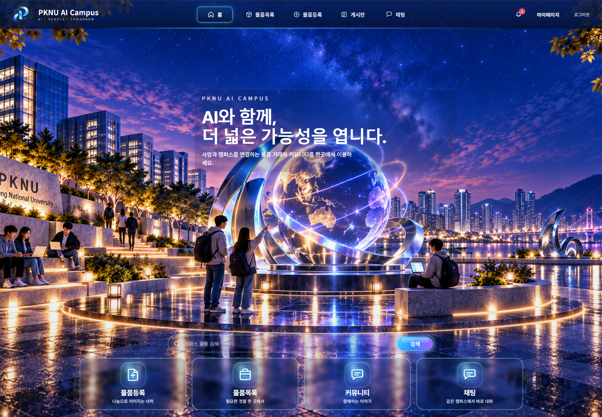
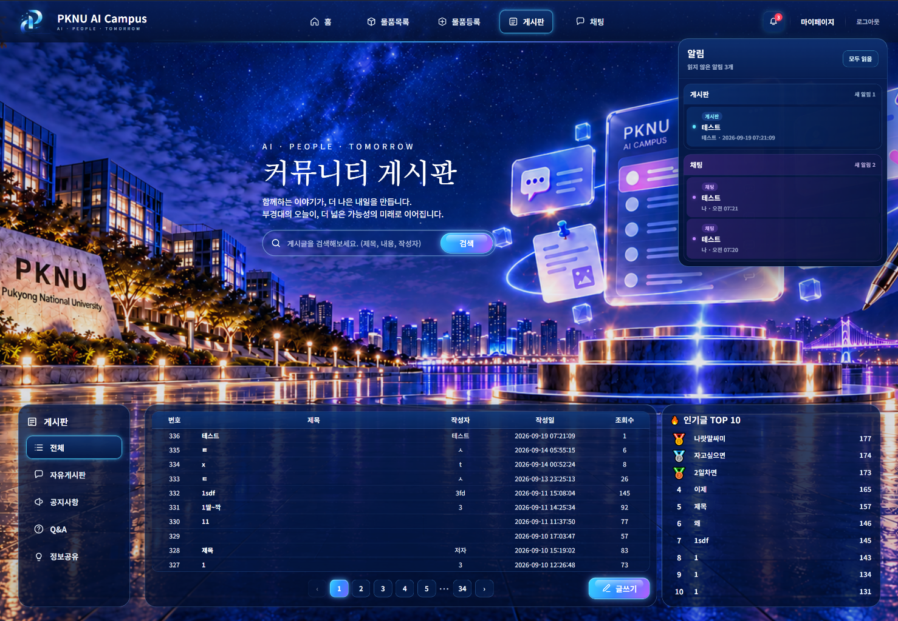
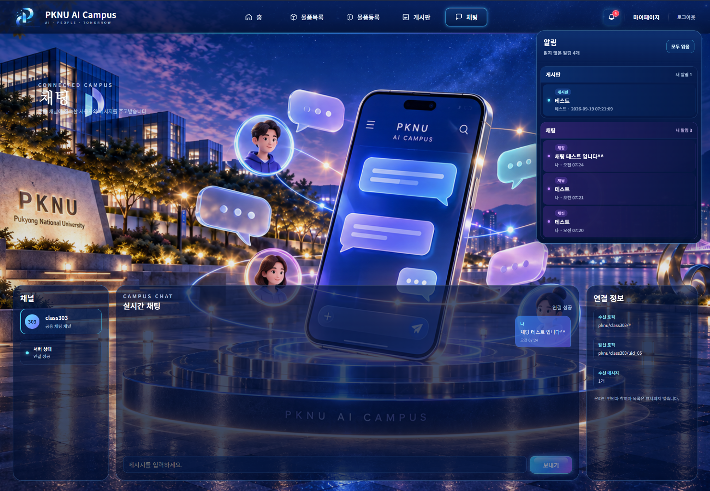
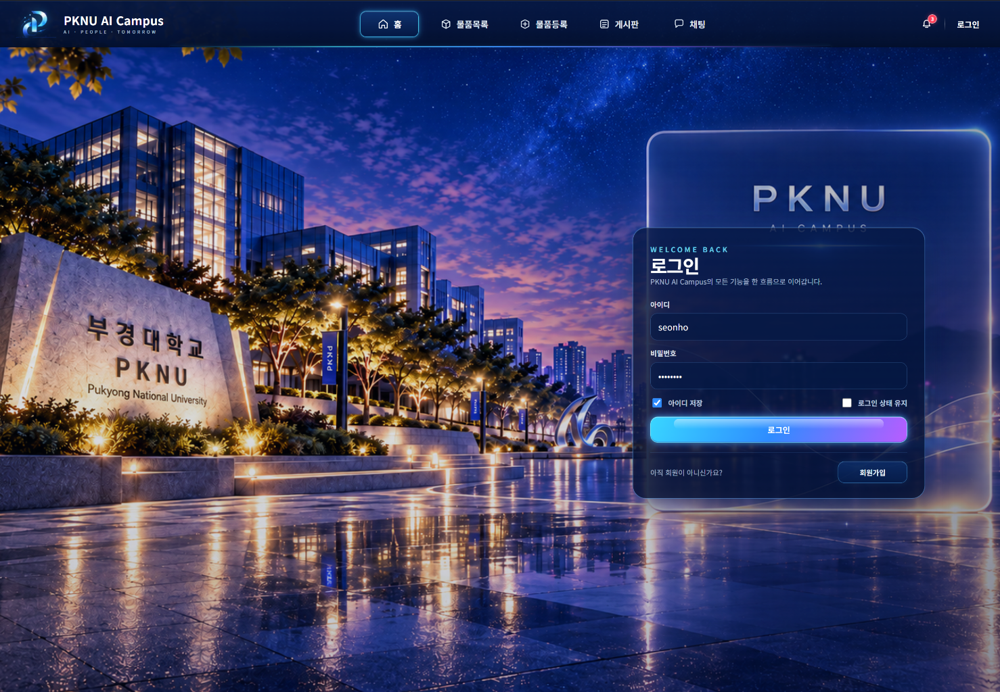

<div align="center">

# PKNU AI Campus

### React 기반 캠퍼스 통합 서비스 프로젝트

**물품 거래 · 커뮤니티 게시판 · 실시간 채팅 · 회원 기능을 하나의 흐름으로 연결한 React/Vite 웹 프로젝트입니다.**

<br />


</div>

---

## 프로젝트 소개

`PKNU AI Campus`는 React 학습 과정에서 구현한 기능들을 단순 예제 화면으로 남기지 않고, **하나의 캠퍼스 서비스처럼 연결해 본 프로젝트**입니다.

처음에는 라우팅, Axios 요청, 상태 관리, 게시판, 회원 기능, MQTT 채팅처럼 각각 따로 학습한 기능에서 출발했습니다. 이후 실제 사용 흐름을 생각하면서 공통 헤더와 화면 디자인을 정리하고, 기능 코드와 디자인 코드를 분리하여 현재 형태로 확장했습니다.

이 프로젝트에서 가장 중요하게 본 부분은 화면을 화려하게 만드는 것보다 다음 흐름을 코드에서 다시 찾을 수 있게 만드는 것이었습니다.

```text
사용자 입력 / 클릭
        ↓
React State
        ↓
이벤트 또는 useEffect
        ↓
Axios API / MQTT
        ↓
응답 및 메시지 처리
        ↓
State 변경
        ↓
화면 재렌더링
```

---

# 실제 실행 화면

아래 이미지는 디자인 시안이 아니라 **프로젝트를 실행한 실제 화면**입니다.

## Home

<p align="center">
  
</p>

홈에서는 서비스 전체 메뉴를 한 번에 확인할 수 있습니다. 상단 메뉴뿐 아니라 하단의 빠른 이동 카드에서 **물품등록 · 물품목록 · 커뮤니티 · 채팅**으로 바로 이동할 수 있습니다.

홈 검색창에 입력한 검색어는 `/item/list?text=검색어` 형태로 물품목록에 전달되어 바로 검색 결과를 확인할 수 있도록 연결했습니다.

---

## Community Board

<p align="center">
  
</p>

게시판은 단순 목록 화면이 아니라 **검색 · 페이지 이동 · 카테고리 이동 · 글쓰기 · 상세조회 · 인기글 TOP 10** 흐름을 한 화면에 구성했습니다.

현재 페이지와 검색어를 React state로 관리하고, state가 변경되면 Axios로 게시글 데이터를 다시 요청합니다. 오른쪽 인기글 영역은 전체 게시글 데이터를 모은 뒤 조회수 기준으로 정렬하여 상위 글을 표시하도록 구성했습니다.

---

## Real-time Chat

<p align="center">
  
</p>

채팅 화면은 MQTT를 이용해 같은 채널의 사용자와 메시지를 주고받는 구조입니다.

연결 상태, 현재 채널, 수신 메시지, 송수신 토픽을 화면에서 확인할 수 있고, 입력한 메시지는 MQTT publish를 통해 전송됩니다. 수신한 메시지는 React state에 추가되어 바로 화면에 반영됩니다.

---

## Login

<p align="center">
  
</p>

로그인은 입력값 검사 → API 요청 → 인증 토큰 확인 → 브라우저 저장소 선택 → Redux 로그인 상태 갱신 → 페이지 이동의 순서로 동작합니다.

`아이디 저장`과 `로그인 상태 유지`를 분리해 두었으며, 로그인 유지 여부에 따라 토큰을 `localStorage` 또는 `sessionStorage`에 저장하도록 구성했습니다.

---

# 주요 기능

| 영역 | 구현 내용 |
|---|---|
| **Home** | 주요 서비스 빠른 이동, 물품 검색어 전달, React Router 페이지 이동 |
| **물품목록** | 서버 목록 조회, 검색, 페이지네이션, 이미지/가격/수량 표시 |
| **물품등록** | 입력 form, 이미지 선택 및 미리보기, `FormData` 기반 파일 업로드 |
| **게시판** | 목록 조회, 검색, 페이지네이션, 카테고리 이동, 상세조회, 글쓰기 |
| **인기글** | 전체 게시글을 모아 조회수 기준 TOP 10 계산 |
| **회원가입** | 회원 입력값 검증 및 가입 API 요청 |
| **로그인** | 토큰 기반 로그인, 아이디 저장, 로그인 상태 유지, Redux 상태 동기화 |
| **마이페이지** | 로그인 보호, 회원정보 수정, 비밀번호 변경, query 기반 탭 전환 |
| **채팅** | MQTT WebSocket 연결, subscribe/publish, 실시간 메시지 표시 |
| **공통 UI** | 공통 상단 네비게이션, 알림 패널, 페이지별 배경/패널 디자인 |

---

# 페이지 구성

React Router를 이용해 URL과 페이지 컴포넌트를 연결했습니다.

| URL | 화면 | 역할 |
|---|---|---|
| `/` | Home | 서비스 메인 / 빠른 이동 / 물품 검색 |
| `/item/list` | ItemList | 물품 검색 및 목록 조회 |
| `/item/insert` | ItemInsert | 물품 등록 및 이미지 업로드 |
| `/board` | Board | 게시판 목록 / 검색 / 인기글 |
| `/board/write` | BoardWrite | 게시글 작성 |
| `/board/content` | BoardContent | 게시글 상세 조회 |
| `/login` | Login | 로그인 |
| `/join` | Join | 회원가입 |
| `/mypage` | MyPage | 회원정보 / 비밀번호 관리 |
| `/chat` | Chat | MQTT 실시간 채팅 |

---

# 기능별 동작 흐름

## 1. 홈 검색

```text
검색어 입력
   ↓
FormData로 query 읽기
   ↓
encodeURIComponent()
   ↓
navigate('/item/list?text=...')
   ↓
ItemList가 URL query 읽기
   ↓
Axios 목록 요청
```

검색어가 없으면 전체 물품목록으로 이동하고, 검색어가 있으면 query string으로 전달합니다.

---

## 2. 물품목록

```text
page / searchText state
        ↓
useEffect
        ↓
GET /api/item/selectlist.json
        ↓
응답 데이터 정리
        ↓
rows state 저장
        ↓
map()으로 물품 카드 출력
```

물품 데이터의 필드명이 조금 달라도 화면에서 사용할 수 있도록 `normalizeItem()`에서 이름을 통일하고, `total / cnt`를 이용해 전체 페이지 수를 계산합니다.

---

## 3. 물품등록

```text
입력값 state
 +
File 객체
   ↓
URL.createObjectURL()
   ↓
이미지 미리보기
   ↓
FormData.append()
   ↓
POST /api/item/insert.json
```

파일 input에서 선택한 이미지는 먼저 브라우저에서 미리보기로 확인할 수 있고, 등록 시 텍스트 데이터와 이미지를 하나의 `FormData`에 넣어 전송합니다.

---

## 4. 게시판

```text
검색어 / page state
       ↓
useEffect
       ↓
GET /api/board/select.json
       ↓
rows / total 저장
       ↓
게시글 테이블 + Pagination
```

게시글 검색 시 페이지를 1페이지로 되돌리고 새 검색어로 다시 조회합니다. 게시글 상세 페이지에서는 선택한 글 번호를 이용해 데이터를 불러오는 흐름으로 연결되어 있습니다.

### 인기글 TOP 10

```text
전체 게시글 요청
      ↓
여러 페이지 데이터 합치기
      ↓
조회수(hit / views) 기준 정렬
      ↓
slice(0, 10)
      ↓
TOP 10 표시
```

현재 페이지 안에서만 순위를 만드는 것이 아니라 가능한 전체 목록을 합친 뒤 인기글을 계산하도록 구성했습니다.

---

## 5. 로그인 / 인증

```text
아이디 + 비밀번호
       ↓
POST /api/member/login.json
       ↓
token 존재 확인
       ↓
localStorage 또는 sessionStorage
       ↓
Redux logged state 갱신
       ↓
navigate('/')
```

HTTP 요청이 성공했다는 이유만으로 로그인 성공으로 처리하지 않고 **실제 인증 token이 존재하는지 다시 확인**합니다.

로그인 관련 저장 처리는 `src/utils/auth.js`에 분리하여 각 페이지에서 브라우저 저장소 구현을 반복하지 않도록 했습니다.

---

## 6. 마이페이지

마이페이지는 로그인하지 않은 사용자가 접근하면 로그인 화면으로 이동합니다.

```text
/mypage?account=info
        ↓
회원정보 변경

/mypage?account=password
        ↓
비밀번호 변경
```

URL query와 현재 탭 state를 맞춰두어 브라우저 뒤로가기를 사용해도 현재 화면이 주소와 함께 유지되도록 구성했습니다.

---

## 7. MQTT 실시간 채팅

```text
MQTT Broker 연결
      ↓
채널 Subscribe
      ↓
메시지 수신
      ↓
messages state 추가
      ↓
화면 표시

입력 메시지
      ↓
Publish
      ↓
같은 채널 사용자에게 전달
```

MQTT 연결 정보와 topic 관련 코드는 `src/utils/chat.js`에 모아두어 채팅 화면과 공통 알림 기능에서 재사용할 수 있도록 했습니다.

---

# API 연결

프론트엔드 소스에서 사용하는 주요 API 경로입니다.

| 기능 | Method | Endpoint |
|---|---|---|
| 물품 목록 | GET | `/api/item/selectlist.json` |
| 물품 등록 | POST | `/api/item/insert.json` |
| 게시판 목록 | GET | `/api/board/select.json` |
| 게시글 상세 | GET | `/api/board/selectonehit.json` |
| 게시글 작성 | POST | `/api/board/insert.json` |
| 회원가입 | POST | `/api/member/join.json` |
| 로그인 | POST | `/api/member/login.json` |
| 회원정보 조회 | GET | `/api/member/selectone.json` |
| 회원정보 수정 | POST | `/api/member/update.json` |
| 비밀번호 변경 | POST | `/api/member/updatepw.json` |

> 이 저장소는 React 프론트엔드 프로젝트가 중심입니다. 목록 조회, 로그인, 게시판 저장 등 서버 데이터가 필요한 기능은 연결된 백엔드 API가 실행 중이어야 정상 동작합니다.

---

# Tech Stack

| 기술 | 프로젝트에서의 역할 |
|---|---|
| **React 19** | 페이지 및 UI 컴포넌트 구성, state 기반 화면 갱신 |
| **Vite 8** | 개발 서버 및 빌드 환경 |
| **React Router DOM** | URL에 따른 페이지 이동 및 query 처리 |
| **Redux Toolkit** | 로그인 상태 전역 관리 |
| **Axios** | REST API 요청 |
| **MQTT.js** | WebSocket 기반 실시간 채팅 연결 |
| **Ant Design** | 일부 UI 컴포넌트 기반 |
| **CSS** | 페이지별 디자인, 공통 레이아웃, 반투명 패널 및 상태 표현 |

---

# 프로젝트 구조

```text
react1/
├─ src/
│  ├─ pages/                  # 실제 페이지 기능 코드
│  │  ├─ Home.jsx
│  │  ├─ ItemList.jsx
│  │  ├─ ItemInsert.jsx
│  │  ├─ Board.jsx
│  │  ├─ BoardContent.jsx
│  │  ├─ BoardWrite.jsx
│  │  ├─ Login.jsx
│  │  ├─ Join.jsx
│  │  ├─ MyPage.jsx
│  │  └─ Chat.jsx
│  │
│  ├─ design/                 # 공통/표시 중심 컴포넌트
│  │  ├─ home/
│  │  ├─ board/
│  │  └─ site/
│  │
│  ├─ styles/                 # 기능 코드와 분리한 CSS
│  ├─ assets/                 # 화면 이미지 및 리소스
│  ├─ utils/
│  │  ├─ auth.js              # 인증 저장/조회/삭제
│  │  └─ chat.js              # MQTT 연결 및 topic 설정
│  ├─ reducers/
│  │  └─ loggedSlice.jsx      # Redux 로그인 state
│  ├─ store.jsx               # Redux store
│  ├─ App.jsx                 # Route 연결
│  └─ main.jsx                # React 시작점
│
├─ docs/
│  └─ images/readme/          # README 실제 실행화면
├─ package.json
└─ vite.config.js
```

---

# 코드 구성 원칙

## 기능 코드와 디자인 코드 분리

기능을 공부하거나 수정할 때 CSS와 장식 코드 때문에 흐름을 놓치지 않도록 역할을 나눴습니다.

```text
pages/
└─ state / event / API / navigate / 데이터 처리

utils/
└─ 인증 / MQTT 등 공통 기능

design/
└─ 공통 헤더 / 패널 / 아이콘 등 표시 컴포넌트

styles/
└─ 색상 / 배치 / 크기 / 배경 / 효과
```

예를 들어 게시판 데이터를 불러오는 핵심은 `Board.jsx`에서 확인하고, 게시판의 시각 스타일은 별도 CSS에서 확인할 수 있도록 구성했습니다.

---

# 이 프로젝트에서 연습한 React 핵심

### State
화면에서 변하는 값인 검색어, 페이지 번호, 목록 데이터, 로그인 상태, 채팅 메시지를 state로 관리했습니다.

### Event
버튼 클릭, form submit, input change와 같은 사용자 행동을 이벤트 함수로 연결했습니다.

### useEffect
페이지 번호나 검색어가 바뀌었을 때 서버 데이터를 다시 가져오거나, MQTT 연결을 만들고 정리하는 작업에 사용했습니다.

### Routing
`Route`와 `navigate()`를 이용해 하나의 React 앱 안에서 여러 서비스 화면을 연결했습니다.

### API Request
Axios를 이용해 GET/POST 요청을 보내고, 서버 응답을 state에 저장해 화면에 표시했습니다.

### Global State
로그인 여부처럼 여러 화면에서 함께 알아야 하는 값은 Redux Toolkit을 이용해 관리했습니다.

### Browser Storage
로그인 유지 여부에 따라 `localStorage`와 `sessionStorage`를 구분해 사용했습니다.

### Real-time Communication
일반 HTTP 요청과 달리 MQTT 연결을 유지하면서 실시간 메시지를 수신하고 전송하는 흐름을 구현했습니다.

---

# 실행 방법

저장소를 Clone한 뒤 프로젝트 폴더에서 패키지를 설치합니다.

```bash
npm install
```

개발 서버 실행:

```bash
npm run dev
```

프로덕션 빌드 확인:

```bash
npm run build
```

빌드 결과 미리보기:

```bash
npm run preview
```

> `node_modules`는 GitHub에 올리지 않습니다. `package.json`과 `package-lock.json`을 기준으로 `npm install`을 실행하면 필요한 패키지가 다시 설치됩니다.

---

# 실행 시 참고

- 화면 자체는 Vite 개발 서버로 실행할 수 있습니다.
- 게시판/물품/회원 기능은 연결된 `/api/...` 백엔드가 필요합니다.
- 채팅은 `src/utils/chat.js`에 설정된 MQTT broker 연결이 필요합니다.
- 서버나 broker가 동작하지 않는 환경에서는 해당 데이터 기능이 제한될 수 있습니다.

---

# Project Notes

이 프로젝트는 **완성된 상용 서비스의 복제**보다 React를 배우면서 구현한 기능을 한 프로젝트 안에서 연결하고, 코드의 흐름을 다시 읽을 수 있게 만드는 데 목적을 두었습니다.

화면 디자인을 확장하면서도 `라우팅 → state → 이벤트 → 요청 → 응답 → 화면 변경`이라는 React의 기본 흐름을 기능 코드에서 확인할 수 있도록 유지하는 것을 기준으로 정리했습니다.

<div align="center">

### PKNU AI Campus
**AI · PEOPLE · TOMORROW**

</div>
