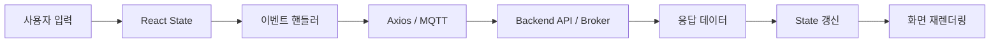

<div align="center">

# 🌌 PKNU AI Campus

### React 기반 캠퍼스 통합 웹 서비스

물품 거래 · 게시판 · 회원 기능 · 실시간 채팅을 하나의 UI로 구성한 React 프로젝트입니다.

<br />


<br />


</div>

---

## 📌 프로젝트 소개

**PKNU AI Campus**는 캠퍼스 안에서 사용할 수 있는 여러 기능을 하나의 React 애플리케이션으로 구성한 프로젝트입니다.

단순 화면 구현에 그치지 않고 **React Router를 이용한 페이지 이동, Axios 기반 REST API 통신, 로그인 상태 관리, 파일 업로드, 검색·페이지네이션, MQTT 실시간 채팅**까지 연결했습니다.

또한 공부할 때 기능 흐름을 쉽게 읽을 수 있도록 **학습용 기능 코드와 디자인 코드를 가능한 분리**하고, 주요 파일에는 상태 → 이벤트 → API → 화면 갱신 흐름을 확인할 수 있는 주석을 정리했습니다.

---

## ✨ 주요 기능

| 기능 | 구현 내용 |
|---|---|
| 🏠 **홈** | 주요 메뉴 이동, 물품 검색어 전달 |
| 📦 **물품목록** | API 목록 조회, 검색, 페이지네이션, 이미지 표시 |
| ➕ **물품등록** | 입력 상태 관리, 이미지 미리보기, `FormData` 파일 업로드 |
| 📝 **게시판** | 게시글 목록 조회, 검색, 페이지 이동, 상세 페이지 이동 |
| ✍️ **글쓰기** | Controlled Input, POST 요청, 등록 후 목록 이동 |
| 🔐 **로그인** | 로그인 API, 토큰 저장, 로그인 유지 선택 |
| 👤 **마이페이지** | 회원정보 조회·수정, 비밀번호 변경 |
| 💬 **채팅** | MQTT 연결, 메시지 송수신, 연결 종료 cleanup |

---

## 🛠 Tech Stack

### Frontend

- **React 19** — 컴포넌트 기반 UI
- **Vite 8** — 개발 서버 / 빌드 환경
- **React Router DOM 7** — SPA 라우팅
- **Redux Toolkit + React Redux** — 로그인 상태 공유
- **Axios** — REST API 통신
- **Ant Design** — UI 컴포넌트 활용
- **MQTT.js** — 실시간 채팅 연결

### Styling

- CSS 기반 커스텀 UI
- Glass / Neon 스타일의 캠퍼스 테마
- 기능 JSX와 디자인 레이어를 가능한 분리
- 공통 헤더·쉘·게시판 디자인 컴포넌트 재사용

---

## 🧭 화면 구성

```text
/
├─ /item/list       물품목록
├─ /item/insert     물품등록
├─ /board           게시판
├─ /board/write     게시글 작성
├─ /board/content   게시글 상세
├─ /login           로그인
├─ /join            회원가입
├─ /mypage          마이페이지
└─ /chat            실시간 채팅
```

---

## 🔄 주요 동작 흐름



### 예: 물품목록

```text
검색어 입력
   ↓
query state 변경
   ↓
검색 버튼 submit
   ↓
searchText 확정 + page 1 초기화
   ↓
useEffect 실행
   ↓
Axios GET
   ↓
서버 응답 → rows / total
   ↓
map()으로 카드 렌더링
```

---

## 📂 프로젝트 구조

```text
react1/
├─ src/
│  ├─ assets/       이미지 / 브랜드 리소스
│  ├─ design/       표시 중심 디자인 컴포넌트
│  ├─ pages/        실제 페이지 기능 코드
│  ├─ reducers/     Redux 상태 관리
│  ├─ styles/       페이지 / 공통 디자인 CSS
│  ├─ utils/        인증 / 채팅 공통 로직
│  ├─ App.jsx       URL ↔ 페이지 연결
│  └─ main.jsx      React 앱 시작점
│
├─ package.json
├─ vite.config.js
└─ README.md
```

### 코드 분리 원칙

```text
기능 코드
  pages / utils / reducers
       ↓
state · event · API · navigation

디자인 코드
  design / styles
       ↓
layout · color · effect · reusable UI
```

기능 흐름을 공부할 때 CSS와 시각 효과 때문에 핵심 로직이 가려지지 않도록 구성하는 것을 목표로 했습니다.

---

## 🧠 이 프로젝트에서 익힌 것

- `useState`로 입력값과 화면 상태 관리
- `useEffect`로 페이지 진입 / 상태 변화에 따른 API 호출
- `map()`을 이용한 서버 데이터 반복 렌더링
- `React Router`의 `Route`, `navigate`, query string 사용
- Axios `GET / POST / PUT` 요청 흐름
- `FormData`를 이용한 이미지 업로드
- 로그인 토큰과 `localStorage / sessionStorage` 관리
- Redux를 이용한 전역 로그인 상태 공유
- MQTT 연결 / 구독 / 발행 / cleanup 흐름
- 기능 코드와 디자인 코드의 역할 분리
- API 응답을 화면용 데이터 구조로 변환하는 과정

---

## 🚀 실행 방법

### 1. Repository Clone

```bash
git clone https://github.com/HWANG-SEONHO/react1.git
cd react1
```

### 2. 패키지 설치

```bash
npm install
```

### 3. 개발 서버 실행

```bash
npm run dev
```

기본 개발 주소:

```text
http://localhost:5173
```

---

## 📜 Scripts

| 명령어 | 설명 |
|---|---|
| `npm run dev` | Vite 개발 서버 실행 |
| `npm run build` | 배포용 빌드 생성 |
| `npm run lint` | Oxlint 코드 검사 |
| `npm run preview` | 빌드 결과 미리보기 |

---

## 🎯 프로젝트에서 중요하게 본 부분

이 프로젝트에서는 단순히 완성된 화면을 만드는 것보다 다음 내용을 직접 읽고 설명할 수 있도록 코드를 구성했습니다.

> **사용자 입력 → State → Event → API → Response → State 변경 → 화면 갱신**

새 기능을 추가할 때도 이 흐름을 기준으로 코드가 어디에서 시작되고 어디에서 화면으로 연결되는지 추적하는 것을 목표로 합니다.

---

## 👨‍💻 Author

**HWANG-SEONHO**

- GitHub: [HWANG-SEONHO](https://github.com/HWANG-SEONHO)
- Repository: [react1](https://github.com/HWANG-SEONHO/react1)

---

<div align="center">

### PKNU AI Campus
**AI · PEOPLE · TOMORROW**

</div>
