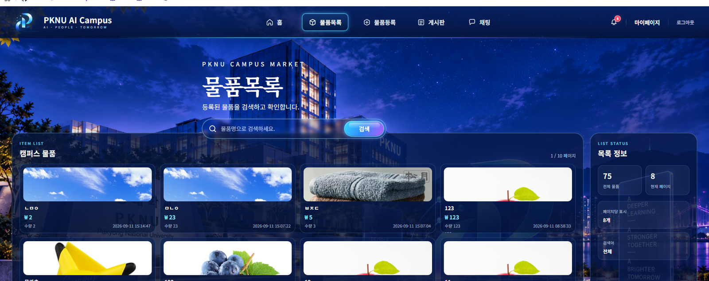
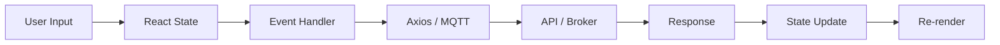

<div align="center">

# PKNU AI Campus

### React 기반 캠퍼스 통합 웹 서비스

물품 거래 · 커뮤니티 · 회원 관리 · 실시간 채팅을 하나의 화면 흐름으로 구성한 React 학습 프로젝트입니다.

<br />


<br />


</div>

---

## Project Overview

**PKNU AI Campus**는 캠퍼스 안에서 필요한 기능을 하나의 SPA로 연결한 프로젝트입니다.

React의 상태 관리와 라우팅에서 시작해 REST API 통신, 인증 토큰 저장, 이미지 업로드, 검색·페이지네이션, MQTT 실시간 채팅까지 직접 연결했습니다. 또한 학습할 때 기능 흐름을 쉽게 읽을 수 있도록 **기능 코드와 디자인 코드를 가능한 분리**하고, 핵심 파일에는 `state → event → API → response → render` 흐름을 따라갈 수 있는 주석을 정리했습니다.

---

## Main Screen

### 물품목록



- 서버 목록 조회 및 검색
- 페이지네이션
- 카드형 물품 UI
- 이미지 비율 유지 표시
- 검색어와 페이지 상태에 따른 재조회

---

## Design Gallery

> 아래 이미지는 각 페이지에 사용되는 프로젝트 디자인 자산입니다.

<table>
  <tr>
    <td align="center"><b>Login</b></td>
    <td align="center"><b>Board</b></td>
  </tr>
  <tr>
    <td></td>
    <td></td>
  </tr>
  <tr>
    <td align="center"><b>Chat</b></td>
    <td align="center"><b>Campus Home</b></td>
  </tr>
  <tr>
    <td></td>
    <td></td>
  </tr>
</table>

---

## Features

| 기능 | 구현 내용 |
|---|---|
| **Home** | 주요 메뉴 이동, 홈 검색어를 물품목록 query string으로 전달 |
| **Item List** | Axios GET, 검색, 페이지네이션, 목록 카드 렌더링 |
| **Item Insert** | 입력 상태 관리, 이미지 미리보기, `FormData` 업로드 |
| **Board** | 게시글 목록 조회, 검색, 페이지 이동, 상세 화면 연결 |
| **Board Write** | Controlled Input, POST 요청, 등록 후 목록 이동 |
| **Login / Join** | 로그인·회원가입 API, 입력 검증, 인증 토큰 저장 |
| **My Page** | 회원정보 변경, 비밀번호 변경 화면 전환 |
| **Chat** | MQTT 연결, topic 구독·발행, cleanup 처리 |

---

## Tech Stack

### Frontend

- **React 19** — 컴포넌트 기반 UI
- **Vite 8** — 개발 서버 및 빌드 환경
- **React Router DOM 7** — SPA 라우팅
- **Redux Toolkit / React Redux** — 전역 로그인 상태 관리
- **Axios** — REST API 통신
- **Ant Design** — UI 컴포넌트
- **MQTT.js** — 실시간 메시지 연결

### UI / Styling

- CSS 기반 커스텀 디자인
- Glass / Neon 계열 캠퍼스 테마
- 공통 `SiteShell`, Header, Board 디자인 컴포넌트 재사용
- 기능 JSX와 디자인 레이어 분리

---

## Application Routes

```text
/
├─ /item/list       물품목록
├─ /item/insert     물품등록
├─ /board           게시판
├─ /board/write     게시글 작성
├─ /board/content   게시글 상세
├─ /login           로그인
├─ /join            회원가입
├─ /mypage          마이페이지
└─ /chat            실시간 채팅
```

---

## Core Flow



### Example — Item Search

```text
검색어 입력
   ↓
query state 변경
   ↓
검색 submit
   ↓
searchText 확정 + page = 1
   ↓
useEffect 실행
   ↓
Axios GET
   ↓
rows / total 갱신
   ↓
map()으로 카드 렌더링
```

---

## Project Structure

```text
react1/
├─ src/
│  ├─ assets/       페이지 이미지 / 브랜드 리소스
│  ├─ design/       표시 중심 디자인 컴포넌트
│  ├─ pages/        페이지 기능 코드
│  ├─ reducers/     Redux 상태 관리
│  ├─ styles/       페이지 / 공통 CSS
│  ├─ utils/        인증 / 채팅 공통 로직
│  ├─ App.jsx       URL ↔ 페이지 연결
│  └─ main.jsx      React 앱 시작점
│
├─ docs/
│  └─ images/       README용 실제 화면 이미지
│
├─ package.json
├─ vite.config.js
└─ README.md
```

### 기능 코드와 디자인 코드 분리

```text
pages / utils / reducers
        ↓
state · event · API · navigation

          VS

design / styles
        ↓
layout · color · effect · reusable UI
```

디자인을 수정할 때 기능 로직을 건드리는 범위를 줄이고, 학습할 때는 기능 흐름만 빠르게 찾을 수 있도록 구성했습니다.

---

## What I Learned

- `useState`를 이용한 입력값·화면 상태 관리
- `useEffect`의 의존성 변화와 API 재호출 흐름
- `map()`을 이용한 서버 데이터 반복 렌더링
- `Route`, `navigate`, query string 기반 페이지 연결
- Axios `GET / POST / PUT` 요청 흐름
- `FormData`를 이용한 이미지 파일 업로드
- `localStorage / sessionStorage`를 이용한 로그인 유지
- Redux를 이용한 전역 인증 상태 공유
- MQTT 연결 / 구독 / 발행 / cleanup
- 기능 코드와 디자인 코드의 역할 분리

---

## Run Locally

```bash
git clone https://github.com/HWANG-SEONHO/react1.git
cd react1
npm install
npm run dev
```

개발 서버 기본 주소:

```text
http://localhost:5173
```

> `/api` 요청은 `vite.config.js`의 개발용 proxy 설정을 사용합니다. 백엔드 서버 상태에 따라 일부 기능은 로컬에서 별도 서버 연결이 필요할 수 있습니다.

---

## Scripts

| 명령어 | 설명 |
|---|---|
| `npm run dev` | Vite 개발 서버 실행 |
| `npm run build` | 배포용 빌드 생성 |
| `npm run lint` | Oxlint 코드 검사 |
| `npm run preview` | 빌드 결과 미리보기 |

---

## Portfolio Point

이 프로젝트에서 가장 중요하게 본 것은 완성된 화면만 만드는 것이 아니라, 아래 흐름을 **직접 읽고 수정할 수 있는 코드 구조**로 만드는 것입니다.

> **User Input → State → Event → API → Response → State Update → UI**

---

<div align="center">

### HWANG-SEONHO

[GitHub](https://github.com/HWANG-SEONHO) · [Repository](https://github.com/HWANG-SEONHO/react1)

<br />

**PKNU AI Campus — AI · PEOPLE · TOMORROW**

</div>
