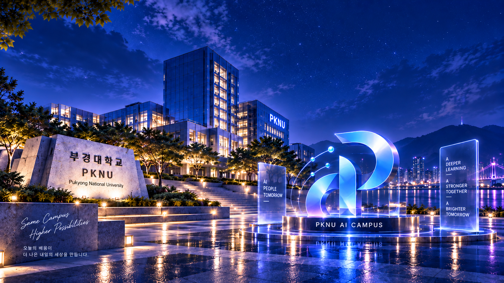
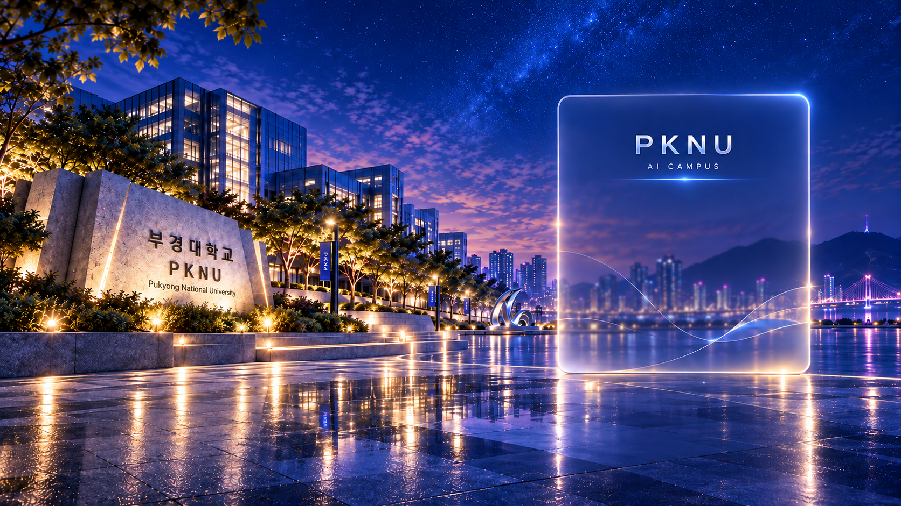

<div align="center">

# PKNU AI Campus

### React 기반 캠퍼스 통합 커뮤니티 · 물품 · 채팅 웹 프로젝트

**게시판 · 물품 검색/등록 · 실시간 채팅 · 회원 기능을 하나의 캠퍼스 서비스로 구성했습니다.**

</div>

---

## Main

<p align="center">
  
</p>

메인 화면에서 주요 서비스로 이동하고, 캠퍼스 서비스의 전체 흐름을 한눈에 확인할 수 있도록 구성했습니다.

---

## 주요 기능

| 기능 | 내용 |
|---|---|
| **Home** | 서비스 소개 및 주요 메뉴 진입 |
| **게시판** | 게시글 목록, 상세조회, 작성, 페이지 이동 |
| **물품목록** | 물품 조회, 검색, 페이지네이션 |
| **물품등록** | 이미지와 상품 정보 등록 |
| **채팅** | MQTT 기반 실시간 메시지 처리 |
| **회원 기능** | 로그인, 회원가입, 마이페이지 |

---

## 주요 화면

### 게시판
<p align="center">
  
</p>

게시판 기능 코드와 시각 디자인 영역을 분리해 기능 흐름을 읽기 쉽게 정리했습니다.

### 물품 서비스
<p align="center">
  
</p>

물품 검색, 목록 조회, 페이지네이션, 이미지 표시, 물품 등록 기능을 제공합니다.

### 로그인 / 회원
<p align="center">
  
</p>

로그인과 회원 관련 화면을 동일한 디자인 시스템으로 구성했습니다.

### 실시간 채팅
<p align="center">
  
</p>

MQTT를 이용한 실시간 채팅 기능을 캠퍼스 UI에 통합했습니다.

---

## Tech Stack

<div align="center">


</div>

---

## 프로젝트 구조

```text
src/
├─ pages/       # 페이지별 기능 코드
├─ design/      # 표시/디자인 전용 컴포넌트
├─ styles/      # 페이지 및 공통 스타일
├─ assets/      # 실제 사용 이미지/리소스
├─ utils/       # 인증·채팅 등 공통 기능
└─ reducers/    # 상태 관리
```

### 코드 정리 원칙

- **학습용 기능 코드와 디자인 코드를 분리**
- React 상태/API/이벤트 흐름은 `pages`에서 확인 가능하도록 유지
- 반복되는 시각 요소는 `design`과 `styles`로 분리
- 학습 핵심 구간에는 기능 흐름을 이해할 수 있는 주석 추가
- 실제 실행에 사용하는 `src`를 기준 소스로 관리

---

## 핵심 구현 흐름

```text
사용자 입력
   ↓
React State
   ↓
이벤트 / useEffect
   ↓
Axios API 또는 MQTT
   ↓
응답 데이터 처리
   ↓
화면 재렌더링
```

단순 화면 제작보다 **데이터가 어디에서 들어오고, 어떤 상태를 거쳐 화면에 표시되는지 이해할 수 있도록 코드 구조를 정리**했습니다.

---

## 실행

```text
npm install
npm run dev
```

---

## Repository

이 저장소는 React 학습 과정에서 구현한 기능을 실제 캠퍼스 서비스 형태의 UI와 결합해 발전시킨 프로젝트입니다.
